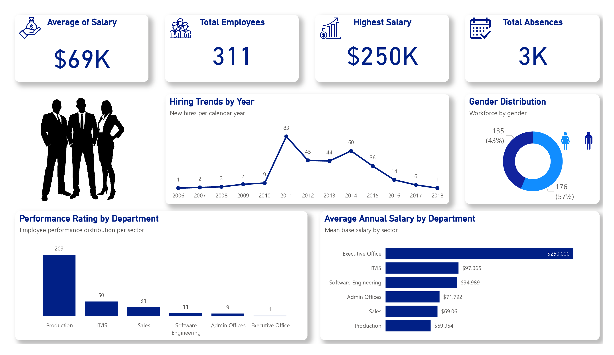

# People Analytics: Strategic Human Capital Management 👥📊
## HR Insights & Strategic People Analytics Dashboard 📈

---

##  Descrição do Projeto
Este projeto transforma dados brutos de RH em inteligência de negócio. O dashboard oferece visibilidade sobre padrões de contratação, disparidades salariais e saúde operacional do capital humano, permitindo decisões embasadas sobre promoções e orçamentos.

##  Project Description
This project transforms raw HR data into business intelligence. The dashboard provides visibility into hiring patterns, salary disparities, and human capital operational health, enabling data-driven decisions on promotions and budgeting.

---

## 🚀 Resultados e Insights | Results & Insights

###  Impacto Organizacional
* **Evolução da Força de Trabalho:** Monitoramento de picos de contratação histórica.
* **Eficiência Salarial:** Comparativo de médias por setor para equilíbrio orçamentário.
* **Padronização Internacional:** Unidades de medida ajustadas para o padrão global (K para milhares).

###  Organizational Impact
* **Workforce Evolution:** Monitoring historical hiring peaks.
* **Salary Efficiency:** Comparative average analysis by sector for budgetary balance.
* **International Standardization:** Measurement units adjusted to global standards (K for thousands).

---

## 🛠️ Destaques Técnicos | Technical Highlights

###  Funcionalidades Principais
* **DAX Avançado:** Criação de medidas personalizadas para formatação de KPIs ($K e K).
* **Composição Demográfica:** Diversidade de gênero e perfil dos colaboradores.
* **Foco Operacional:** KPIs centrais (Média Salarial, Total de Colaboradores e Absenteísmo).

###  Key Features
* **Advanced DAX:** Custom measures for KPI formatting ($K and K).
* **Demographic Composition:** Gender diversity and employee profiles.
* **Operational Focus:** Central KPIs (Average Salary, Total Employees, and Absenteism).

---

## 🔧 Ferramentas | Tools
* **Power BI:** Dashboards interativos e Medidas DAX.
* **Power Query:** Tratamento de dados e ETL.
* **Data Source:** Dataset Público (Kaggle - HRDataset_v14).

---
## Como visualizar | How to view
Para interagir com os filtros, baixe o arquivo `.pbix`. 
To interact with filters, please download the `.pbix` file.
